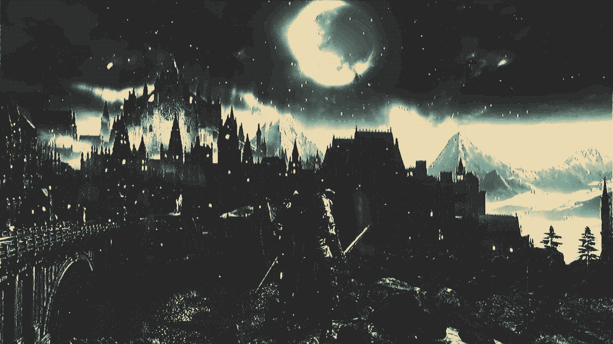
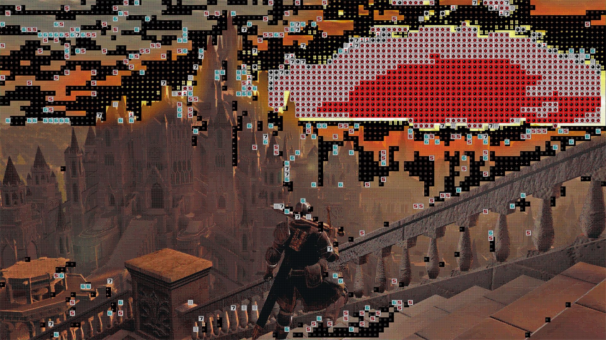
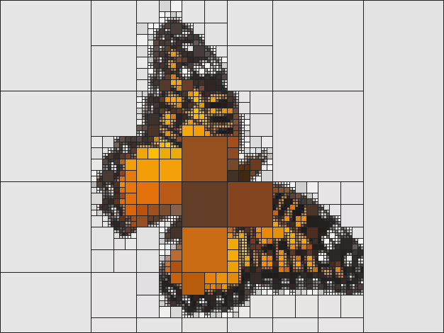

# jamsworld

A Windows XP-styled web application replica using React that
specialises in image processing.

## Features

- Resizable & Moveable windows.
- Applications z index is properly managed across applications
- Startup XP animation
- Some cool applications
- Image processing using webGPU (cool processing passes)
- Image/Gif/Video/Camera Processing Pipelines

## Demo


## Examples








## Installation

To set up the project locally, follow these steps:

1. Clone the repository:

   ```bash
   git clone https://github.com/blankprogram/jamsworld.git
   ```

2. Install dependencies:

   ```bash
   npm install
   ```

3. Start the server:

   ```bash
   npm start
   ```

## Usage

### PixelPass

The **PixelPass** app allows you to apply multiple filters to an image in sequence, giving you full control over the effects.

1. **Select a file**: Upload an image/gif or video.
2. **Add filters**: Use the "Add Filter" button to select filters.
3. **Adjust filter settings**: Click on any filter to open and modify its specific settings.
4. **Reorder filters**: Drag and drop filters to change their order of application.
5. **Mask settings**: To use masks click on mask settings.
6. **Apply filters**: Click "Apply Filters" and wait for the processed image or GIF to appear.

## Other

- Currently using a webGPU only path for image processing so hopefully you have a browser that supports it (wanted compute shaders : ) ).
- GIF transparency encoding isn't perfect but I'll work on it.
- Some other projects of mine are there (e.g., ElementSim, CirFinity)

## Thank you to

- [ShizukuIchi's winXP project](https://github.com/ShizukuIchi/winXP) -- Inspired the project!.
- [clippyjs](https://github.com/pithings/clippy)
- [webamp](https://github.com/captbaritone/webamp)
- [Acerola](https://www.youtube.com/@Acerola_t) -- Inspiring me to take on graphics!

